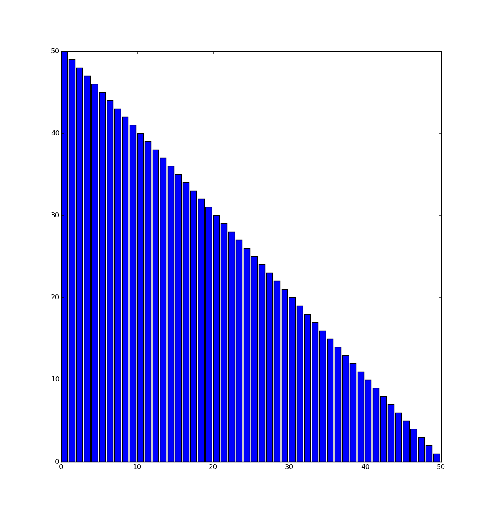
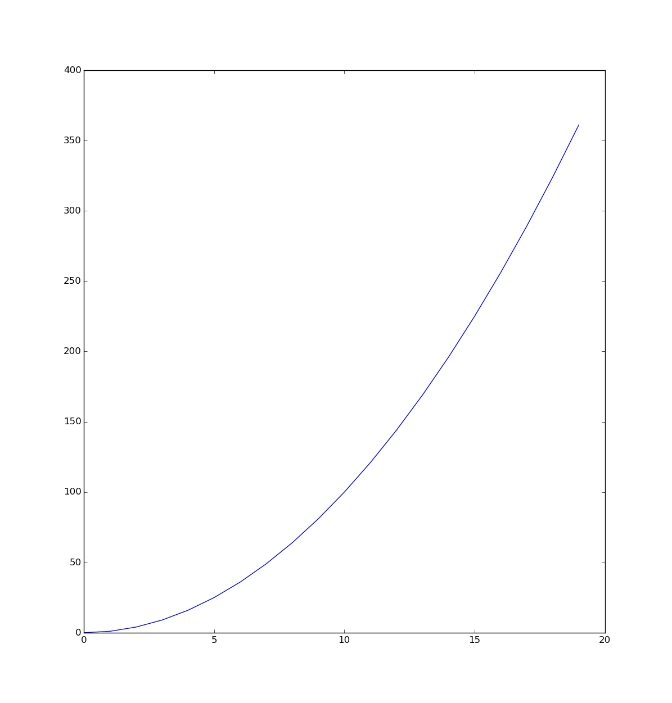
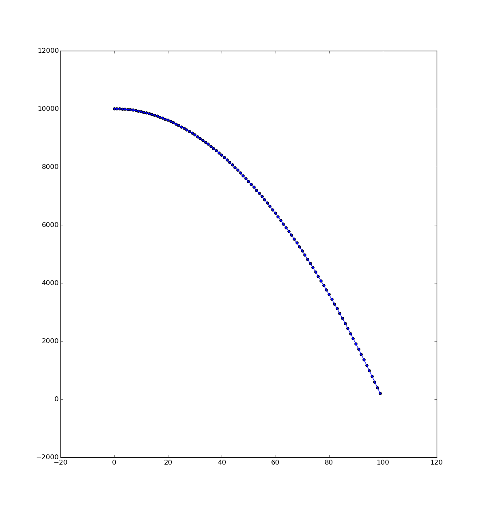

# Visualising Sorting With Python 1 - Graphing Data

This lesson will introduce students to visualising data by using Python's matplotlib library. In order for the students to follow this lesson, they will need to use computers with Python 3 and matplotlib installed. 

## Installing matplotlib

To install matplotlib, follow the instructions below.

### Linux (Debian-based distro)

1. Open a Terminal window
2. Run the command `sudo apt-get install python3-matplotlib`

### Mac OS X and Windows

1. Install with pip using the command `pip3 install matplotlib`
2. Alternatively, install from the [matplotlib website](http://matplotlib.org/faq/installing_faq.html#how-to-install)

## Learning objectives

- To understand how to use a simple list comprehension to create a random list of numbers
- To be able to produce simple graphs using matplotlib

## Learning outcomes

### All students are able to

- Use a list comprehension to produce a random list of numbers
- Plot a simple scatter graph using matplotlib

### Most students are able to

- Plot a variety of different graphs using matplotlib
- Plot an interactive graph using matplotlib

### Some students are able to

- Add axes and title to a matplotlib graph

## Lesson summary

Learning about sorting algorithms is a particularly dry topic for many students. By allowing students to produce a variety of sorting algorithms and visualise them running, they will gain a greater appreciation for what the algorithms are doing and hopefully find the topic a little more interesting.

## Starter

- Ask students about the different ways we can visualise data.
- Ask what might be the most appropriate graphs to visualise the following data sets:
 1. The percentages of people who voted for different parties in an election.
 1. The changes in a population of deer over the course of a decade.
 1. The average temperatures each day over the course of a month.

## Main development

- Students should work through the first part of the worksheet, which introduces them to the concept of list comprehensions to construct lists of numbers.

- After the majority of students have completed the list comprehension exercises, you can have a quick competition to see who can write list comprehensions to create the following lists:

1. `[0,1,2,3,4,5,6,7,8,9]`
1. `[5,6,7,8,9]`
1. `[-9,-8,-7,-6,-5,-4,-3,-2,-1,0]`
1. `[0,2,4,6,8,10]`
1. `[[0,0,0],[1,1,1],[2,2,2]]`

Example solutions are:

1. `[i for i in range(10)]`
1. `[i for i in range(5,10)]`
1. `[i for i in range(-9,1)]`
1. `[i for i in range(0,11,2)]` or `[i for i in range(0,12,2)]`
1. `[[i] * 3 for i in range(3)]`

- Students should then work through the second part of the worksheet, which introduces them to the concept of drawing graphs with matplotlib.

## Plenary

After the majority of students have completed the graphing tasks, you can have a quick competition to see who can write code to create the following graphs:

 

## Homework

- Students should conduct some research to come up with a list of sorting algorithms. No details are required of the sorts for now.
