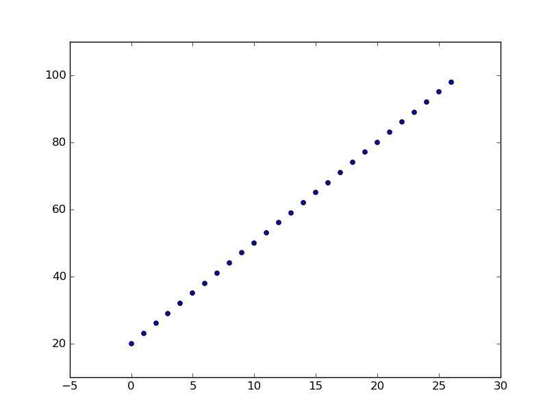

# Visualising Sorting with Python 1 - Graphing Data

...

## Introduction

Academics in the fields of Mathematics, the Sciences and the Humanities often need to present the data from their research and experiments.

A key tool used by many academics is the Python programming language along with a library called Matplotlib. Infact Matplotlib is fast becoming the standard graphing tool used in Scientific publications.

In this lesson, you will be learning how to use Python to create lists of numbers, and then using matplotlib to graph those numbers.

## Producing lists of numbers

1. A list is a data structure - a way of storing data.
1. If you wanted to store the numbers `0` through to `9` in Python, you could write a list like this.

	```python
	numbers = [0,1,2,3,4,5,6,7,8,9]
	```

1. That's fairly simple for small lists, but if you wanted all the numbers from `0` to `9999` you would be typing for quite a long time.

1. When programming, if you ever find yourself performing a very repetitive task, there's probably an easier way of doing it. In this case, a fairly simple way to create the 10000 number list would be to use a loop.

1. Open your Python IDE and try typing the following into a new file called `lists.py`.

	```python
	numbers = []
	for i in range(10000):
		numbers.append(i)
	```

1. Run your code and then and then type `numbers` into the interpreter to see the list you have created.

## List comprehensions

1. Creating lists with loops is fairly simple, but there is a more powerful way of creating lists in many languages. It's called a list comprehension.

1. The list creation above can be simplified to:

```python
numbers = [i for i in range(10000)]
```

1. The first `i` is the value the is going to be placed in the list. The second `i` represents every value between 0 and 10000.

1. Have a go at making the following lists using list comprehensions
    1. [0,1,2,3,4,5,6,7,8]
    1. [1,2,3,4,5,6,7,8,9,10,11,12,13,14,15]

1. You can use the full range of parameters in a list comprehension that is available in the `range()` function. So if you wanted to start at a different value to produce `[5,6,7,8,9]` for instance, you could write:

	```python
	numbers = [i for i in range(5,10)
	```

1. Try using list comprehensions to crete the following lists:
    1. [10,11,12,13,14,15,16,17,18,19]
    1. [-5,-6,-7,-8,-9,0]

1. You can also pass in a step value into the `range()` function to get lists that skip numbers like `[0,2,4,5,8]`:

```python
numbers = [i for i in range(0,10,2)]
```

1. Try using list comprehensions to crete the following lists:
    1. [0,3,6,8,12]
    1. [10,8,6,4,2,0]
	1. [0,-1,-2,-3,-4,-5]

## Graphing lists of numbers

1. To produce a standard graph, you need to use two sets of values. Open up a new Python file and call it `graphing.py`

1. You can start by producing two lists of numbers to graph. It doesn't really matter what numbers they are, but they must be the same length. We can acheive this by using the inbuilt `len()` function in Python. Call the lists `y` and `x`.

	```python
	y = [i for i in range(20,100,3)]
	x = [i for i in range(len(y))]
	```

1. Now that you have the numbers, you can create a graph to display them. To do this, you will need to use the matplotlib library. At the top of your file write the following line:

	```python
	import matplotlib.pyplot as plt
	```

1. To create a simple scatter graph of the numbers, you can just write the following two lines at the bottom of your file:

	```python
	plt.scatter(x,y)
	plt.draw()
	```

1. Your entire file should now look like this:

	```python
	import matplotlib.pyplot as plt

	y = [i for i in range(20,100,3)]
	x = [i for i in range(len(y))]


	plt.scatter(x,y)
	plt.draw()
	```

1. A window should appear with your graph drawn.



1. Close the window. You can now try drawing some different styles of graph. Alter the line:

	```python
	plt.scatter(x,y)
	```

so that it reads

	```python
	plt.plot(x,y)
	```

then run your code again.

1. You can also try `plt.bar`

2. If you want to have a scatter plot with the points joined up, you can combine `plot` and `scatter`

	```python
	plt.plot(x,y)
	plt.scatter(x,y)
	```


1. Try to alter your `y` list comprehension and the type of graph you're drawing to produce the following three graphs


## Interactive plotting


...

